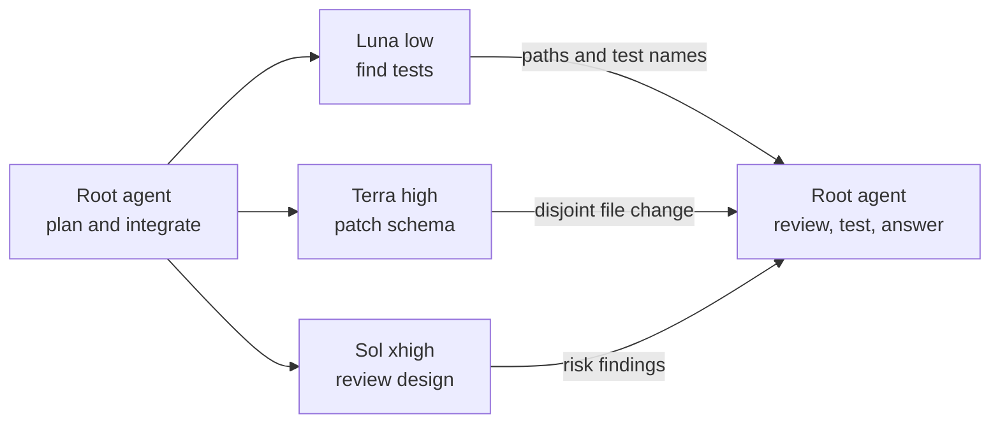

# Vicente's Codex

Vicente's Codex is a Luna-aware fork for running several agents at once. It caps concurrent work, preserves incomplete states, and lets `gpt-5.6-luna` run as a `multi_agent_v2` root or child without changing the model catalog.

## What this fork covers

### Available now

- **V2 by default.** New sessions use `multi_agent_v2`. Configuration can opt out; resumed sessions keep the backend they started with.
- **Turn-scoped coordination.** Targeted waits observe up to eight named agents and return sorted terminal changes. Untargeted waits wake on mailbox activity. Required, non-detached children remain joined at turn finalization.
- **Capacity-aware scheduling.** The cap limits active V2 child turns, not agent history. A terminal child releases its permit. When the root spawns at capacity, the tool call waits for a permit within a fixed deadline; nested children fail fast to avoid self-deadlock.
- **Durable delegation records.** Stable run identities, delivery receipts, fenced state transitions, scoped cancellation, and explicit unresolved or partial outcomes survive in SQLite. Reconciliation runs at turn completion, not in a background daemon, and a restart does not reattach every child.
- **Agent workspace.** `/agent` shows nested paths, lifecycle, plans, requested and effective model/effort, token usage, and estimated cost when available.
- **App-server runtime state.** V2 thread reads expose the effective model and effort plus durable, exact-turn plan snapshots. Unavailable values remain explicit.

### Still evolving

The TUI still needs richer progress and telemetry views.

Durable retry and retention APIs are not yet a complete runtime recovery loop.

The new coordination journal, command, inbox, and recovery state machines are internal groundwork. They do not yet provide a public coordination capability.

Treat missing telemetry and unresolved recovery as real states, not as evidence of success.

## Use this fork

Clone the fork, build it, and put it first on your `PATH`:

```sh
git clone https://github.com/vicentereig/codex.git vicentes-codex
cd vicentes-codex/codex-rs
cargo build --release -p codex-cli
mkdir -p "$HOME/.local/bin"
install -m 0755 target/release/codex "$HOME/.local/bin/codex"
hash -r
codex --version
```

Before opening a Luna session, set the non-reserved tool namespace in
[Configure it](#configure-it). Then use prompts such as these to exercise
coordination and deliberate swarm planning:

```text
Use Luna medium. Split this change into research, edit, and review tasks. Keep required children joined before you finalize. Detach only work I mark as background.
```

```text
Use Luna high. Delegate this migration with durable run identities. After an interruption or restart, report which durable records are resolved, unresolved, or partial. Do not infer that an unobserved child succeeded.
```

```text
Investigate this question: can a city reduce peak summer temperatures by 3–5°C without adding air-conditioning capacity? Before researching, show the task breakdown, subagent tree, model and effort for each task, the evidence standard, and the stopping condition. Use Luna low for primary sources, Luna medium for comparable measurements, Terra high for methodology and contradictions, Sol xhigh to challenge causal claims, and Sol ultra to synthesize a decision-ready report. Use nested agents for independent source review. Do not modify files. Separate measured results from projections and label uncertainty.
```

For the product overview and official docs, see [OpenAI's Codex README](CODEX_README.md). For detailed build notes, see [LOCAL_BUILD.md](LOCAL_BUILD.md).

## Configure it

`multi_agent_v2` is enabled by default. Luna sessions must also use a
non-reserved tool namespace:

```toml
model = "gpt-5.6-luna"
model_reasoning_effort = "medium"

[features.multi_agent_v2]
expose_spawn_agent_model_overrides = true
max_concurrent_threads_per_session = 4
tool_namespace = "agents"
```

The thread cap includes the root agent, so `4` leaves three slots for children. `expose_spawn_agent_model_overrides` adds `model` and `reasoning_effort` to `spawn_agent`.

The fork retains upstream's `collaboration` default, but the Responses API can
reserve that namespace for a server-owned schema and reject a client-declared
tool before the prompt reaches the model. The same collision is documented for
Sol in [openai/codex#31864](https://github.com/openai/codex/issues/31864).
`agents` avoids it for Luna. Existing sessions keep their recorded tool
surface, so start a fresh session after changing the namespace.

### Select a backend or disable agents

For new sessions, this fork selects V2 unless you explicitly opt out:

| Configuration                                                  | New-session backend      |
| -------------------------------------------------------------- | ------------------------ |
| Omit both settings, or enable `features.multi_agent_v2`        | V2                       |
| `features.multi_agent_v2 = false`                              | V1 compatibility backend |
| `features.multi_agent_v2 = false` and `agents.enabled = false` | Agents disabled          |

`features.multi_agent_v2` is authoritative: `[agents] enabled = false` alone
does not override V2. Either TOML form below opts a new session out of V2:

```toml
[features]
multi_agent_v2 = false
```

```toml
[features.multi_agent_v2]
enabled = false
```

Resumed and forked sessions preserve their recorded V1, V2, or disabled
backend so changing the default cannot rewrite an existing thread's tool
surface.

Restart Codex, then enter `/debug-config` in the TUI to inspect the loaded settings.

## How v2 works

The root agent delegates independent, bounded tasks, continues local work, then reviews the results. Each child gets the same tools and shares the workspace. Assign editing agents separate files because their changes appear in one working tree.

`task_name` gives each child a stable path. Agents can message one another and spawn descendants; the root can send follow-up work or wait for a needed result.

`fork_turns` controls conversation context, not file access:

| Value                           | Child context          | Use it when                                                 |
| ------------------------------- | ---------------------- | ----------------------------------------------------------- |
| Omitted or `"all"`              | Full forkable history  | The task depends on decisions made across the conversation. |
| A positive string such as `"3"` | The latest three turns | Recent context matters, but older discussion does not.      |
| `"none"`                        | No parent conversation | The task message stands alone.                              |

Use model and effort overrides with `"none"` or a positive turn count. The
shipped agent guidance keeps full-history forks on the parent model and effort.
A full-history fork also cannot override `agent_type`.

## One delegation round

Suppose the root must change a configuration loader. It can assign three side tasks:

```json
[
  {
    "task_name": "find_tests",
    "message": "Find the loader tests that cover table-form feature settings. Report file paths and test names; do not edit files.",
    "model": "gpt-5.6-luna",
    "reasoning_effort": "low",
    "fork_turns": "none"
  },
  {
    "task_name": "patch_schema",
    "message": "Update the schema fixture for the new setting and run its focused check. Edit only the schema fixture.",
    "model": "gpt-5.6-terra",
    "reasoning_effort": "high",
    "fork_turns": "3"
  },
  {
    "task_name": "review_design",
    "message": "Review the proposed loader change for compatibility and missing cases. Return findings only.",
    "model": "gpt-5.6-sol",
    "reasoning_effort": "xhigh",
    "fork_turns": "3"
  }
]
```

Codex issues one `spawn_agent` call per object.



Keep work that blocks the next step with the root.

## When the cap is full

Set a small cap to see the scheduler work under pressure:

```toml
[features.multi_agent_v2]
max_concurrent_threads_per_session = 4
```

Four threads means the root plus three children. Ask for four:

```text
Use Luna medium. Start four agents now: audit the retry logic, profile the slow
query, draft release notes, and run the focused test suite. Do not wait for one
to finish before requesting the fourth.
```

The fourth root `spawn_agent` call waits inside the active tool call while the
other children run. When a permit becomes available, it retries the
transaction. If the deadline expires first, the tool says that no child was
created and reports the wait budget. This is a bounded wait, not a durable
background queue.

When a parent turn is cancelled, Codex marks its pending delegation
obligations before aborting the parent task. Turn finalization reports required
children that settled as failed or cancelled. The `interrupt_agent` tool
itself returns the target's previous status; settlement can follow later.

## Choose a model and effort

Raise effort only when the task needs more reasoning. Luna supports `low` through `max`; Terra and Sol also support `ultra`. Defaults are `medium` for Luna and Terra and `low` for Sol.

| Task                       | Model and effort | Example                                                             |
| -------------------------- | ---------------- | ------------------------------------------------------------------- |
| Fast fact or search        | Luna `low`       | Locate a config key and cite its tests.                             |
| Small, bounded edit        | Luna `medium`    | Rename a known symbol and run one focused test.                     |
| Routine repository work    | Terra `medium`   | Add validation in one crate with tests.                             |
| Multi-file debugging       | Terra `high`     | Trace a setting from TOML through runtime state.                    |
| Hard design or review      | Sol `high`       | Find compatibility risks in a protocol change.                      |
| Architecture and synthesis | Sol `xhigh`      | Split a cross-crate migration into safe stages.                     |
| Parallel coordination      | Sol `ultra`      | Coordinate independent research, implementation, and review tracks. |

Use `max` only when `xhigh` cannot resolve an ambiguous problem.

## Build and install

Install the prerequisites listed in [LOCAL_BUILD.md](LOCAL_BUILD.md), then build and install the fork:

```sh
cd codex-rs
cargo build --release -p codex-cli
mkdir -p "$HOME/.local/bin"
install -m 0755 target/release/codex "$HOME/.local/bin/codex"
hash -r
```

Keep `~/.local/bin` before package-manager paths. Then run:

```sh
command -v codex
codex --version
```

The path should be `~/.local/bin/codex`. Fork releases encode the upstream
release, Vicente revision, and release seed commit, for example:

```text
codex-cli 0.145.0-alpha.24-vicentes-version.0.9.0+openai.312caf176a
```

## Rebase on upstream

Keep `origin` on this fork and `upstream` on `openai/codex`:

```sh
git fetch upstream
git rebase upstream/main
cd codex-rs
just fmt
just test -p codex-core
git push --force-with-lease origin main
```

Review the Luna exception after each rebase.

This repository retains Codex's [Apache-2.0 license](LICENSE).
