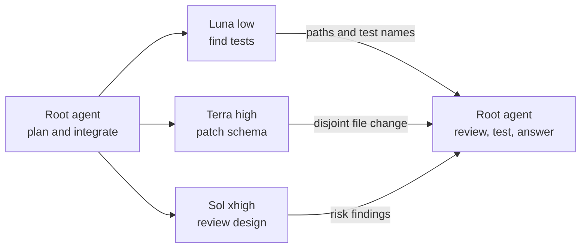

# Luna-aware Codex

Upstream marks `gpt-5.6-luna` as a v1 multi-agent model. This personal fork lets Luna run as a `multi_agent_v2` root or child without changing the model catalog.

For the product overview and official docs, see [OpenAI's Codex README](CODEX_README.md). For detailed build notes, see [LOCAL_BUILD.md](LOCAL_BUILD.md).

## Configure it

Add these settings to `~/.codex/config.toml`:

```toml
model = "gpt-5.6-luna"
model_reasoning_effort = "medium"

[features.multi_agent_v2]
enabled = true
expose_spawn_agent_model_overrides = true
max_concurrent_threads_per_session = 4
```

The thread cap includes the root agent, so `4` leaves three slots for children. `expose_spawn_agent_model_overrides` adds `model` and `reasoning_effort` to `spawn_agent`.

Restart Codex, then enter `/debug-config` in the TUI to inspect the loaded settings.

## How v2 works

The root agent delegates independent, bounded tasks, continues local work, then reviews the results. Each child gets the same tools and shares the workspace. Assign editing agents separate files because their changes appear in one working tree.

`task_name` gives each child a stable path. Agents can message one another and spawn descendants; the root can send follow-up work or wait for a needed result.

`fork_turns` controls conversation context, not file access:

| Value | Child context | Use it when |
| --- | --- | --- |
| Omitted or `"all"` | Full forkable history | The task depends on decisions made across the conversation. |
| A positive string such as `"3"` | The latest three turns | Recent context matters, but older discussion does not. |
| `"none"` | No parent conversation | The task message stands alone. |

Model and effort overrides work with all three forms. A full-history fork cannot override `agent_type`.

## One delegation round

Suppose the root must change a configuration loader. It can assign three side tasks:

```json
[
  {
    "task_name": "find_tests",
    "message": "Find the loader tests that cover table-form feature settings. Report file paths and test names; do not edit files.",
    "model": "gpt-5.6-luna",
    "reasoning_effort": "low",
    "fork_turns": "none"
  },
  {
    "task_name": "patch_schema",
    "message": "Update the schema fixture for the new setting and run its focused check. Edit only the schema fixture.",
    "model": "gpt-5.6-terra",
    "reasoning_effort": "high",
    "fork_turns": "3"
  },
  {
    "task_name": "review_design",
    "message": "Review the proposed loader change for compatibility and missing cases. Return findings only.",
    "model": "gpt-5.6-sol",
    "reasoning_effort": "xhigh",
    "fork_turns": "all"
  }
]
```

Codex issues one `spawn_agent` call per object.



Keep work that blocks the next step with the root.

## Choose a model and effort

Raise effort only when the task needs more reasoning. Luna supports `low` through `max`; Terra and Sol also support `ultra`. Defaults are `medium` for Luna and Terra and `low` for Sol.

| Task | Model and effort | Example |
| --- | --- | --- |
| Fast fact or search | Luna `low` | Locate a config key and cite its tests. |
| Small, bounded edit | Luna `medium` | Rename a known symbol and run one focused test. |
| Routine repository work | Terra `medium` | Add validation in one crate with tests. |
| Multi-file debugging | Terra `high` | Trace a setting from TOML through runtime state. |
| Hard design or review | Sol `high` | Find compatibility risks in a protocol change. |
| Architecture and synthesis | Sol `xhigh` | Split a cross-crate migration into safe stages. |
| Parallel coordination | Sol `ultra` | Coordinate independent research, implementation, and review tracks. |

Use `max` only when `xhigh` cannot resolve an ambiguous problem.

## Build and install

Install the prerequisites listed in [LOCAL_BUILD.md](LOCAL_BUILD.md), then build and install the fork:

```sh
cd codex-rs
cargo build --release -p codex-cli
mkdir -p "$HOME/.local/bin"
install -m 0755 target/release/codex "$HOME/.local/bin/codex"
hash -r
```

Keep `~/.local/bin` before package-manager paths. Then run:

```sh
command -v codex
codex --version
```

The path should be `~/.local/bin/codex`; the version should end in `vicentes-version`.

## Rebase on upstream

Keep `origin` on this fork and `upstream` on `openai/codex`:

```sh
git fetch upstream
git rebase upstream/main
cd codex-rs
just fmt
just test -p codex-core
git push --force-with-lease origin main
```

Review the Luna exception after each rebase.

This repository retains Codex's [Apache-2.0 license](LICENSE).
